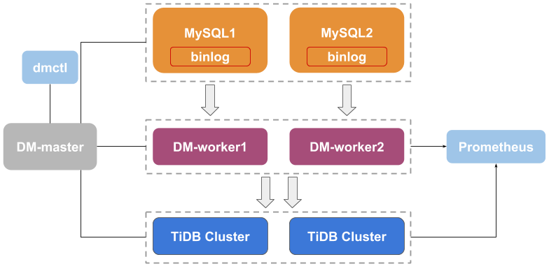

# Data Migration Platform

[](https://internal.pingcap.net/idc-jenkins/job/build_dm_multi_branch/job/master)

[](https://coveralls.io/github/pingcap/dm)
[](https://codecov.io/gh/pingcap/dm)
[](https://goreportcard.com/report/github.com/pingcap/dm)
[](https://app.fossa.com/projects/git%2Bgithub.com%2Fpingcap%2Fdm?ref=badge_shield)
[](https://slack.tidb.io/invite?team=tidb-community&channel=sig-migrate&ref=github_sig)

**DM** is an integrated platform, supports migrating data from MySQL/MariaDB to TiDB.

## Architecture



## Documentation

* [Detailed documentation](https://pingcap.com/docs/tidb-data-migration/stable/)
* [简体中文文档](https://pingcap.com/docs-cn/tidb-data-migration/stable/)

## Building

To check the code style and build binaries, you can simply run:

```bash
make build
```

Notice DM supports building with Go version `Go >= 1.11.4`, and unit test preparation can be found in [Running/Unit Test](tests/README.md#Unit-Test)

If you only want to build binaries, you can run:
```bash
make dm-worker  # build DM-worker

make dm-master  # build DM-master

make dmctl      # build dmctl
``` 

When DM is built successfully, you can find binaries in the `bin` directory.

## Run Test

Run all tests, including unit test and integration test

```bash
make test
```

## Installing

Please reference to "Deploy" section in [our doc](https://docs.pingcap.com/tidb-data-migration/)

## Config File

* all sample config files can be found in directory `conf` of dm tarball
* sample config file of dm-master: `bin/dm-master -print-sample-config`
* sample config file of dm-worker: `bin/dm-worker -print-sample-config`

## Roadmap

Read the [Roadmap](roadmap.md).


## Contributing
Contributions are welcomed and greatly appreciated. See [CONTRIBUTING.md](./CONTRIBUTING.md)
for details on submitting patches and the contribution workflow.

Any questions? Let's discuss in [#sig-migrate in Slack](https://slack.tidb.io/invite?team=tidb-community&channel=sig-migrate&ref=github_sig)

## License
DM is under the Apache 2.0 license. See the [LICENSE](./LICENSE) file for details.


[](https://app.fossa.com/projects/git%2Bgithub.com%2Fpingcap%2Fdm?ref=badge_large)
