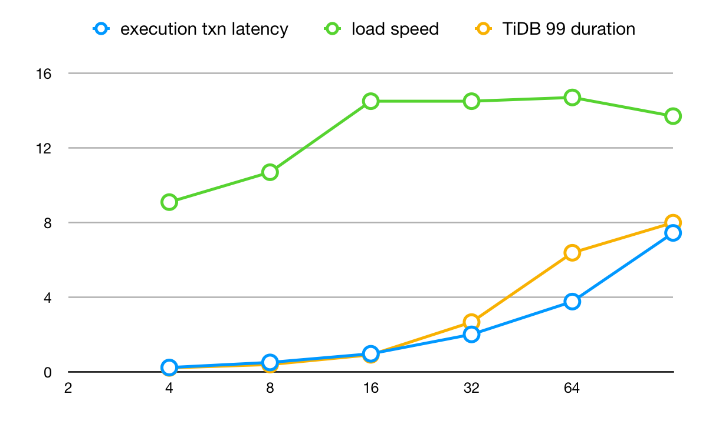

# Proposal: Add flow control for data replication to downstream

- Author(s):    [yangfei](https://github.com/amyangfei)
- Last updated: 2019-09-18

## Abstract

Too fast import data or replication in DM may lead to downstream TiDB too busy to serve as normal. This proposal aims to find a way to detect the congestion of import or replication data flow and introduces a framework of dynamic concurrency control, which will help to control the import and replication data flow.

Table of contents:

- [Background](#Background)
- [Implementation](#Implementation)
    - [Congestion definition](#Congestion-definition)
        - [How to measure the key indicators](#How-to-measure-the-key-indicators)
        - [How to detect and measure congestion](#How-to-detect-and-measure-congestion)
    - [Congestion control framework](#Congestion-control-framework)
        - [The congestion detect component](#The-congestion-detect-component)
        - [The data flow control component](#The-data-flow-control-component)
        - [The concurrency control component](#The-concurrency-control-component)

## Background

Firstly we will discuss the key factor that affects the import or replication speed between DM data processing unit and downstream TiDB.

- In the full data import procedure, data import speed is based on the SQL batch size and SQL executor concurrency. The SQL batch size is mainly determined by the single statement size of dump data, which can be controlled with the `mydumper` configuration. The SQL executor concurrency equals to the worker count of load unit, which is configurated by loader `pool-size` in task config.
- In the incremental data replication procedure, replication speed relates to SQL job batch size and SQL executor concurrency. The binlog replication unit gets data from relay log consumer (assuming the relay log consume speed is fast enough), and distributes SQL jobs to multiple executors, the executor count is configurated by `worker-count` in task config. When the cached SQL job count exceeds SQL batch size (SQL batch size is configurated by `batch` in task config) or every 10ms, all SQLs in these jobs will be executed to downstream in a transaction.

In the full data import scenario, downstream congestion may happen if we have too many DM-workers or much high executor concurrency.

While in incremental data replication scenario the congestion does not happen often, but there still exists some use scenario that may lead to congestion, including

- User pauses replication task for a while and a lot of relay log is accumulated, and the replication node has high concurrency.
- In shard scenario and there are too many upstream shard instances replicating to downstream at the same time.
- In none shard scenario, but there are many tasks replicating to downstream from multiple instances at the same time.

When we encounter these abnormal scenario, we often pause part of the tasks or decrease the SQL executor concurrency. The key point of solving the congestion problem is to reduce the data flow speed. Currently DM has no data flow control, we need to build a data flow control framework which will make data import or replication more smooth, more automotive and as fast as possible. The data flow control framework should provide the following features:

- Downstream congestion definition and auto detection
- Import or replication speed auto control

## Implementation

### Congestion definition

There exists some key concepts in a data import/replication:

- Transaction failure: Each database transaction execution failure is treated as one transaction failure, the failure includes every kind of database execution failure that no data is written to downstream, partial data written error does not include.
- Bandwidth: Bandwidth describes the maximum data import/replication rate from a DM-worker to downstream, this can be measured by TPS from DM-worker (or TPS in downstream, but should only include the data traffic from this DM-worker).
- Latency: Latency is the amount of time it takes for data to replicate from DM-worker to downstream.

The congestion usually means the quality of service decreases because of the service node or data link is carrying more data than it can handle. In the data import/replication scenario, the consequence of congestion can be partial downstream database execution timeout, downstream qps decrease or SQL execution latency increase. We can use these three indicators to determine whether congestion happens and measure the degree of congestion.

#### How to measure the key indicators

Before we can measure the congestion, we should find a way to estimate the transaction failure, the bandwidth and the latency.

- Transaction failure: can be collected in DM-worker itself, and we often use it as transaction failure rate, which means the count of sqls in all failed transaction divided by the count sqls in all transactions that need to be processed.
- Latency: equals to the transaction executed latency, can be collected in DM-worker itself.
- Bandwidth: this is a little complicated, but we can estimate it by adjusting the concurrency and find the maximum downstream TPS for this DM-worker, which can be used as the bandwidth of the data import/replication link.

Take the [benchmark result in DM 1.0-GA](https://pingcap.com/docs/v3.0/benchmark/dm-v1.0-ga/#benchmark-result-with-different-pool-size-in-load-unit) as an example, we extract the result in load unit test, use load unit pool size as X-axis, latency and load speed as Y-axis.



From the benchmark result we can draw the following conclusions:

- The latency grows exponentially as the concurrency increases.
- The TPS grows linely as the concurrency increases in a specific range, in this case the liner range is between 0-16.
- After the TPS reaches the maximum value, it remains the same even the concurrency increases. The maximum value of TPS can be used as the bandwidth.

#### How to detect and measure congestion

Congestion can be exposed in different ways and have different effect on key indicators. We have the following predictive indicators change that may reflect congestion.

- If TPS doesn't increase alongside with the concurrency increase (assuming the dumped data or relay log stream is fast enough), we can believe the congestion is occurring.
- If concurrency doesn't change, but TPS decreases and latency increases significantly (maybe TPS halves and latency doubles), we can believe the congestion is occurring.
- If concurrency doesn't change, TPS and latency don't change too much, but transaction failure rate increases significantly (however in most cases if transaction failure rate increases, we often find TPS decreases and latency increases), we can believe the congestion is occurring.

The congestion degree can be measured by the three indicators, but the workflow in the real world is often complicated, we won't introduce an estimate model in this proposal, as we only need to known whether the congestion is occurring in our congestion control model.

### Congestion control framework

The congestion control framework is separated into three parts, the congestion detect component, the data flow control component and the concurrency control component.

#### The congestion detect component

The congestion detect component will collect the key indicators in DM-worker as following:

- transaction failure rate: we will add a sliding window to record the count of downstream resource busy error (such as `tmysql.ErrPDServerTimeout`, `tmysql.ErrTiKVServerTimeout`, `tmysql.ErrTiKVServerBusy` etc) and the count of all dispatched transactions. The transaction failure rate will be calculated with these two counters.
- TPS detection: we will add a sliding window to record the count of successfully executed transactions, and calculate TPS with this value.
- latency: transaction execution latency is already recorded in load and sync unit, we can use it directly.

#### The data flow control component

This component is responsible to give a reasonable concurrency value based on the data flow stage, current and historical data flow indicators. Firstly we define some stage, which is used to represent the concurrency change stage.

```go
// CongestionStage represents the stage in a congestion control algorithm
type CongestionStage int

// Congestion stage list
const (
    // When the task starts with a low concurrency, the concurrency can be increased fast in this stage.
    StageSlowStart CongestionStage = iota + 1
    // When the concurrency exceeds a threshold, we recommend to increase slowly, which is often called the avoidance stage.
    StageAvoidance
    // The steady stage means the data flow TPS reaches the bandwidth, the latency keeps steady and no transaction failure.
    StageSteady
    // When congestion happens and the concurrency is turned down, we enter the recovery stage.
    StageRecovery
)
```

We can use different congestion algorithm, just to implement the `FlowControl` interface.

```go
type CongestionIndicator struct {
	DataLossRate float64
	TPS          int
	Latency      float64
}

type FlowControl interface {
	// NextConcurrency gives the recommended concurrency value
	NextConcurrency(stage CongestionStage, history []*CongestionIndicator, current *CongestionIndicator) int
}
```

#### The concurrency control component

This component is used to control the concurrency of DM work unit. Currently the code in load unit and sync unit don't support changing `pool-size` or `worker-count` dynamically very well. We have two ways to solve the problem.

1. re-design the concurrent work model and support dynamically changing real worker count.
2. create enough workers when the load/sync unit initializes, and control the concurrency by controlling the working worker number.

We prefer to use the second method, which is more straight forward and less invasive to concurrent framework. The original `pool-size` and `worker-count` configuration will be used as the upper bound of concurrency.
