# Proposal: Manage DDLs on Sharded Tables by Maximizing Schema Compatibility

- Author(s):    [kennytm](https://github.com/kennytm)
- Last updated: 2019-12-09

## Abstract

After installing Schema Tracker on DM workers, the DM master can compare schemas from all shards and produce a joined schema compatible with all DMLs produced by all shards. By diffing the joined schema before and after applying an upstream DDL, the DM master can produce the real DDL to be executed downstream.

## Background

DM is a tool for synchronizing upstream MySQL databases into a downstream TiDB cluster via [row-based replication](https://dev.mysql.com/doc/refman/8.0/en/replication-formats.html). Whenever an SQL statement is executed on MySQL, some binlog events will be sent to the DM worker, which then translates them back into SQL and executed on TiDB.


One major feature of DM is [merging manually sharded tables](https://pingcap.com/docs/dev/reference/tools/data-migration/features/shard-merge/) into a single table.

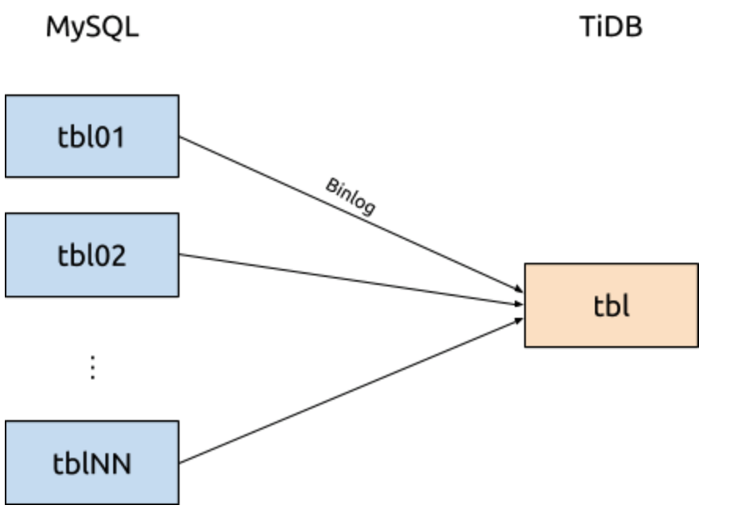

The design difficulty on merging sharded tables is handling schema change (DDLs). Currently, DM resolves this with pessimistic replication: if a DDL statement is executed on tbl01, a [barrier](https://en.wikipedia.org/wiki/Barrier_%28computer_science%29) (known as sharding DDL lock) would be set up to pause all binlogs from tbl01 (including this DDL). The same is applied on all other tables, until the same DDL statement is executed on all of tbl01 to tblNN, where the barrier would be unlocked.

This approach ignores the actual action done by the DDL statement, e.g. even if executing ddl_1; ddl_2; is equivalent to ddl_3; ddl_4;, DM cannot recognize this and will not automatically unlock the barrier, and [require human intervention](https://pingcap.com/docs/dev/reference/tools/data-migration/features/manually-handling-sharding-ddl-locks/). This makes the whole feature feel risky and error-prone.

Even strictly following DDL execution, if the user takes a long time to execute all DDLs, it would create a very long backlog and thus cripples DM’s responsiveness.

## Principles

To prevent the drawbacks mentioned above to make DM more user-friendly, we want to create a barrier-free algorithm (w.r.t. DMLs) for reconciling DDLs on sharded tables.

Note: This work assumes each DM worker already tracks the upstream schema independently from the downstream, so that column order is not a concern.

### DDL awareness

The reason DM chooses pessimistic replication (barrier) is because it is a general solution for all DDL kinds. DM did not need to special case. A barrier-free solution must require DM to understand the meaning of each DDL, however. As an example, blindly propagating a “drop column” DDL from tbl01 would cause error when replicating data from tbl02.

```sql
alter table tbl01 drop column col2;
insert into tbl01 (col1, col3) values (11, 13);
insert into tbl02 (col1, col2, col3) values (21, 22, 23);
```

In our case, we should at least recognize these DDL statements

- `alter table add column [first / after]`

- `alter table drop column`

- `create index`

- `drop index`

- `alter table modify column [first / after]`

and know that some changes are inverse of another (e.g. adding a column and then dropping the same column is equivalent to no-op).

### CRDTs

The opposite of using a barrier is [optimistic replication](https://en.wikipedia.org/wiki/Optimistic_replication), where replicas (schemas of different shards) are allowed to diverge. The cost to this is having to make up a conflict resolution algorithm.

Here we borrow the idea of [conflict-free replicated data type (CRDTs)](https://en.wikipedia.org/wiki/Conflict-free_replicated_data_type). This data structure is conflict-free by defining a commutative, associative and idempotent “merge” function between all states. For shard merging, we use each shard’s schema as the state, and we define the merge function below.

Given a table schema S, We define its set of DMLs C(S) as all DML statements which can be successfully executed in that schema. For instance, with the table schema

```sql
create table S1 (a int not null default 1);
```

the following DML statements are members of C(S1)

```sql
insert into S1 (a) values (5);
insert into S1 () values ();
```

while the following is not a member of C(S1)

```sql
insert into S1 (a) values (null);
```

Subset relationships of set of DMLs form a partial order. We define S1 ≤ S2 iff C(S1) ⊆ C(S2), i.e. S2 can accept more DML statements (producing the same effect) than S1. We call S2 more compatible than S1. For instance, the table schema is strictly more compatible than S1, which accepts the null value.

```sql
create table S2 (a int null default 1);
```

To merge schemas S1, …, Sn, we take the [join](https://en.wikipedia.org/wiki/Join_and_meet) (supremum) in the semilattice formed by compatibility among all schemas. The result is a schema which can accept all DMLs from all shards, no matter how they become.

Why is this concept important? Suppose we drop a column col2 from table tbl01, leaving two different schemas in the same sharding group.

```sql
create table tbl01 (col1 int not null, col3 int not null);
create table tbl02 (col1 int not null, col2 int not null, col3 int not null);
```

The binlog events are not aware of the downstream schema. The merged sharded table tbl must now accept these two DMLs

```sql
insert into tbl01 (col1, col3) values (11, 13);
insert into tbl02 (col1, col2, col3) values (21, 22, 23);
```

Therefore, the downstream schema needs to be changed to tbl01 ∨ tbl02 like

```sql
create table tbl (col1 int not null, col2 int default null, col3 int not null);
```

This suggests that this particular “drop column” DDL propagated downstream should be changed to

```sql
-- transform from: alter table tbl drop column col2;
alter table tbl modify column col2 int default null;
```

Note that the intended result of running the DML is also important in determining compatibility. Consider the following two schemas:

```sql
create table S5 (a int not null default 5);
create table S6 (a int not null default 6);
```

Although both accept the DML

```sql
insert into S () values ();
```

For S5 this will insert a row with a = 5, while for S6 this will insert a row with a = 6. As the results are different, S5 and S6 are incompatible with each other.

In the rest of this document, we would express compatibility relationships using DAGs like this, where properties at the top are more compatible.

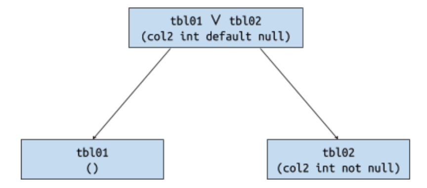

### From schema diffs to DDL

The idea of CRDTs give us what the merged schema should look like, but it does not tell us how to construct SQL statements to reach that schema. In fact, there may be multiple pathways to the same schema. For instance, to change from T1 to T2,

```sql
create table T1 (a int, b int, c int);
create table T2 (b int, c int, d int);
```

one could either rename column a to d and reorder it, or drop a and then add d, or successively rename a → b → c → d, etc.

```sql
alter table T change column a d int after c;
alter table T drop column a, add column d int;
alter table T rename column a to b, rename column b to c, rename column c to d;
```

While all of these produce the same schema, the actual data in each would be wildly different. Therefore, even though there are tools like [migra](https://djrobstep.com/docs/migra) which can automatically compute the necessary DDLs from the start and end schemas alone, we must rely on which upstream DDL statements executed to improve the accuracy.

Additionally, some schemas can indeed have conflict because no DDLs exist to move between different schema. As an example

```sql
create table S3 (a int, b float not null);
create table S4 (a int, b datetime not null);
```

In the joined schema S3 ∨ S4, the column b would have type varchar(24). But TiDB does not support changing the type of a column (nor does this join really make sense), and hence DM shall emit an error and forces S4 to pause synchronization.

## Design

### DM master

When a DM worker of a sharded table receives a DDL binlog event, it must upload the DDL and the schema after applying the DDL to DM master, instead of executing it on TiDB directly. The DM master must ensure the DDLs are sequentially and atomically managed. DML statements are still executed directly by DM worker without consulting DM master.

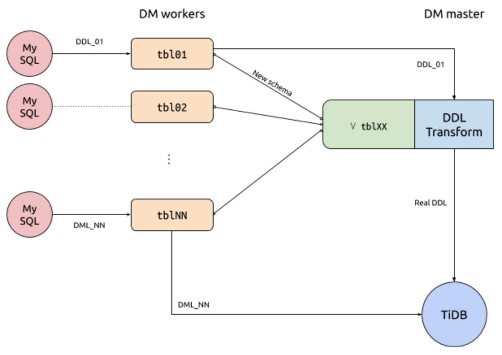

#### Error handling

DM master should ensure only one DDL from the sharding group is processed at a time. If the DDL from tbl01 leads to errors, the master should reply to tbl01 that the DDL is unacceptable. Example:

```sql
-- Original schema: create table tbl (a int);
alter table tbl02 add column b float;
-- Current schema: create table tbl (a int, b float default null);
alter table tbl01 add column b datetime;
-- Error! Column b cannot be both float and datetime
insert into tbl02 (a, b) values (1, -2.5);
insert into tbl01 (a, b) values (3, now());
-- ^ one of these two rows must be lost
```

In this case, the row from tbl01 can never be synchronized.

When DM worker received an error notification from DM master, it needs to pause synchronization of DMLs. User can perform DDLs upstream on tbl01 or any other shards (all DDLs should continued to be sent to DM master), until DM master finds the conflict is resolved, who will actively tell DM worker that the DMLs may be resumed.

To fix this, we could either

- `drop column b on tbl02, add column b with type datetime`

- `drop column b on tbl01, add column b with type float`

In the first case, the conflict of tbl01 is resolved non-intrusively (not touching tbl01’s data and schema). The paused DML events become valid, and can continue to be propagated.

In the second case, the conflict of tbl01 is resolved intrusively (touching tbl01’s data or schema). The DMLs during the conflict are invalid, and should be disposed of.

Intrusively resolving the conflict does not always lead to invalid DMLs though.

```sql
-- Original schema: create table tbl (a int);
alter table tbl02 add column c text;
-- Current schema: create table tbl (a int, c text default null);
alter table tbl01 add column c datetime;
-- Error! Column b cannot be both text and timestamp
insert into tbl02 (a, c) values (1, 'content');
insert into tbl01 (a, c) values (3, now());
```

We could resolve the conflict by alter table tbl01 modify column c text;. Because MySQL is weakly typed, a datetime value can be inserted directly into a text column, meaning the DML is still synchronizable.

It is difficult to programmatically decide when a DML is valid or not. Therefore, after the conflict is resolved, we choose to let DM syncer continue processing binlogs from where it was first paused.

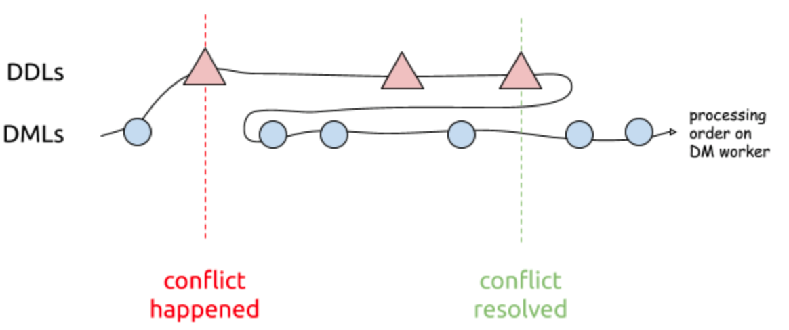

If certain DMLs are truly invalid, it should pause the DM worker again, and this offending binlog event could be got rid of by [dmctl’s sql-skip --binlog-pos feature](https://pingcap.com/docs/dev/reference/tools/data-migration/skip-replace-sqls/#sql-skip). The requirement of human intervention here is unfortunate but unavoidable.

### Modifying column types

When receiving one of these DDL statements:

```sql
alter table tbl01 alter column col2 set default expr;
alter table tbl01 alter column col2 drop default;
alter table tbl01 change column col2 col2 col_spec;
alter table tbl01 modify column col2 col_spec;
```

Compute the most compatible column type new_col_spec among all shards, then modify the column using new_col_spec instead.

#### Nullability

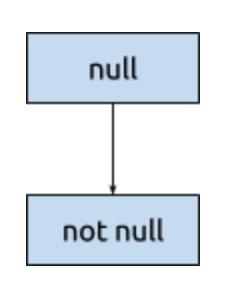

A null column is strictly more compatible than a non null column.

Effectively, as soon as the column of one shard becomes null, this should be propagated downstream immediately. On the other hand, to convert a column to non null, we need to wait until all shards are modified.

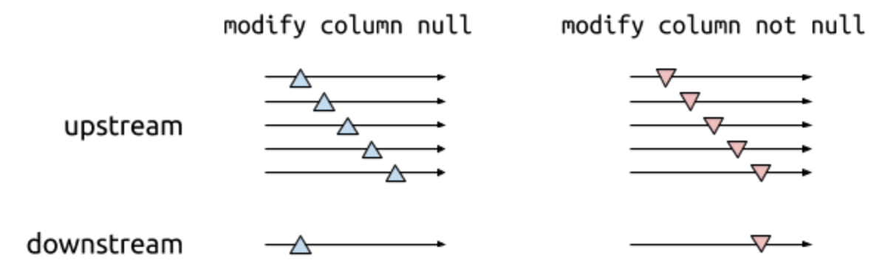

#### Defaultness

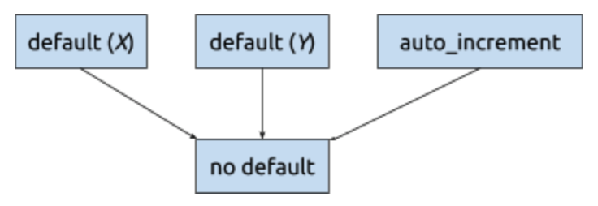

Having a default value is similar. However, columns with different default value are incompatible and should raise error.

#### Precision

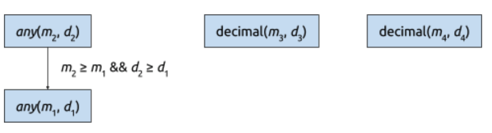

TiDB only allows increasing precision. Additionally, the precision of the decimal type cannot be changed on TiDB, so these always result in error too.

#### Character sets

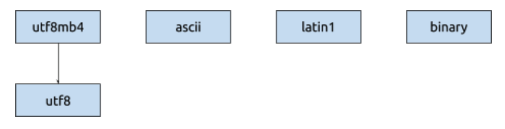

Only utf8 < utf8mb4 is supported. All other character sets cannot be joined.

#### Character types

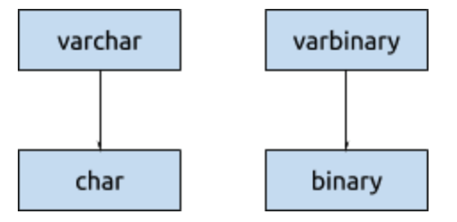

Note that char(n) charset binary is equivalent to binary(n).

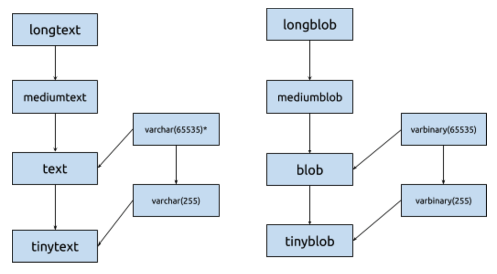

varchar(65535) only exists for latin1 and ascii character sets. For utf8 and utf8mb4, the types text and varchar(255) cannot be joined.

#### Integer types

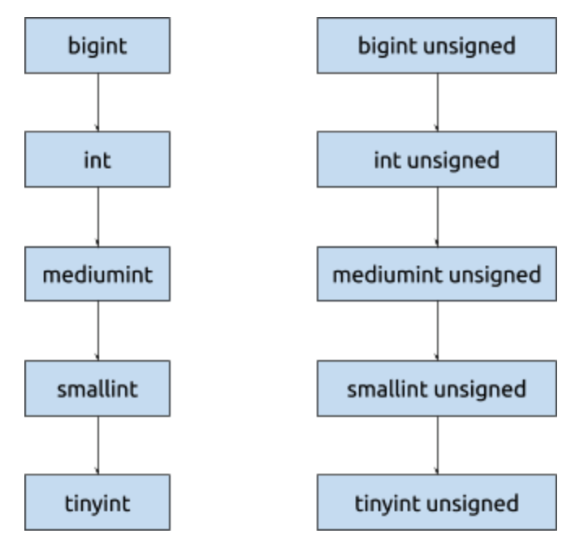

TiDB does not support changing signedness.

#### Sets and enums

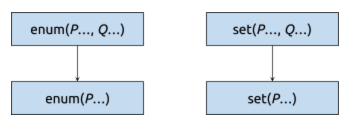

Changing enums and sets are compatible only if members are appended to the end.

#### Other types

The remaining (year, date, time, datetime, timestamp, float, double, decimal, bit, json) are independent and cannot be converted to or from other types.

### Constraints and indices

A table with less constraints are more compatible. Therefore, a DDL adding constraints should be executed last, while a DDL removing constraints should be executed first.

#### Checks

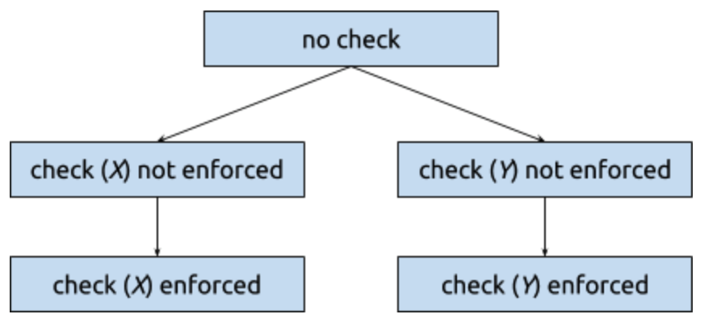

When encountering DDLs modifying checks, either propagate the DDL or drop it depending whether the check (with the same name) still exists in the joined schema.

```sql
alter table tbl01 add check (expr);
alter table tbl01 drop check name;
alter table tbl01 alter check name [not] enforced;
```

(Note that, in MySQL, “check” clauses in a “modify column” DDL is ignored.)

#### Indices

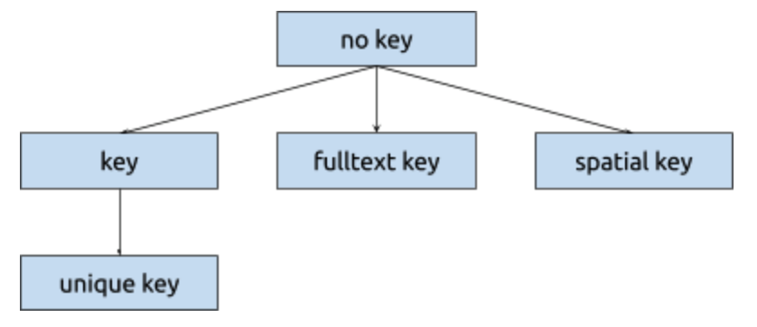

When encountering DDLs adding or removing indices, either propagate the DDL or drop it depending whether the index (with the same name) still exists in the joined schema. DM master should reply to DM worker as soon as possible, without waiting for TiDB to complete adding the indices.

```sql
alter table tbl01 add [spatial | fulltext | unique] key name (cols);
alter table tbl01 alter check name [not] enforced;
alter table tbl01 drop key name;
create [spatial | fulltext | unique] index name on tbl01 (cols);
drop index name on tbl01;
alter table tbl01 modify column col02 col_spec unique;
alter table tbl01 rename key old_name to new_name;
```

#### Foreign keys

(TODO; Not supported by TiDB)

### Adding and dropping columns

Columns can be in one of three states:

- Exists on all shards

- Partially exists

- Dropped from all shards

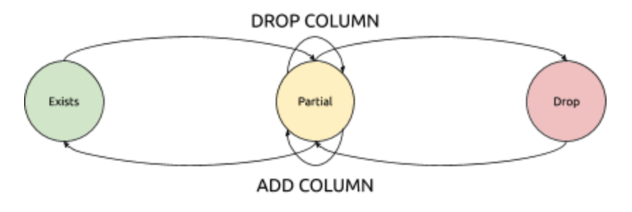

Since DM master has a copy of all sharded schemas, it can simply count how many times this column exists on each shard to determine the column’s state in the joined schema.

#### Adding column on first shard (dropped → partial)

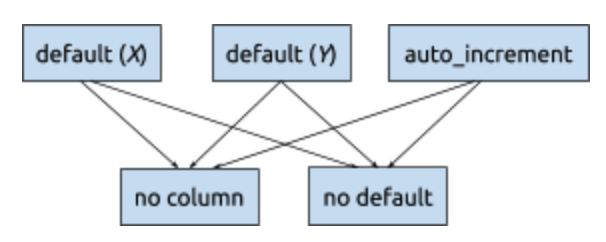

When adding a column which did not exist before, we should change the specification to include a default value if not given.

| Type | Default | Type | Default |
| ---- | ------- | ---- | ------- | 
| Any nullable type | null | year | '0000' |
| int | 0 | date | '0000-00-00' |
| float/double | 0.0 | time | '00:00:00' |
| decimal | 0 | datetime | '0000-00-00 00:00:00' |
| bit | 0 | timestamp | '0000-00-00 00:00:00' |
| char/varchar/text | '' | enum/set | 0 |
| binary/varbinary/blob | '' | json | 'null' |

For instance, these 3 DDL statements

```sql
alter table tbl01 add column col4 int;
alter table tbl01 add column col5 int not null unique;
alter table tbl01 add column col6 int not null default 3;
```

should be converted to these in downstream

```sql
alter table tbl add column col4 int default null;
alter table tbl add column col5 int not null default 0;
alter table tbl add column col6 int not null default 3;
```

Note that if the new column contains any “unique” or “check” constraints, they would be ignored as described in the [Constraints and indices](#constraints-and-indices) section.

#### Adding column on remaining shards (partial → partial)

Executing “add column” on the remaining shards should be translated to “modify column” on downstream, e.g. if we further execute

```sql
alter table tbl02 add column col4 bigint;
```

DM master should turn this into

```sql
alter table tbl modify column col4 bigint default null;
```

As usual, if the type is not changed nothing should executed.

#### Adding column on last shard (partial → exists)

When the last shard has completed adding the column,

```sql
alter table tblNN add column col5 int not null unique;
```

DM master should drop the default value (if needed), and also populate any associated checks and indices.

```sql
alter table tbl alter column col5 drop default;
alter table tbl add unique key col5 (col5);
```

#### Dropping column on first shard (exists → partial)

Dropping a column reverses the action done by adding column.

```sql
alter table tbl01 drop column col7;
```

DM master would keep the column but add a default. In addition, all indices and checks associated with this column should be immediately dropped, before receiving any DML events from tbl01.

```sql
alter table tbl alter column col7 drop default;
alter table tbl drop key col7;
alter table tbl drop check tbl_chk_7;
```

#### Dropping column on remaining shards (partial → partial)

At this stage dropping the same column just become no-op.

#### Dropping column on last shard (partial → dropped)

When the last shard has dropped the column, the DDL can be finally be propagated to downstream.

```sql
alter table tbl drop column col7;
```

### Renaming columns

**Important**: TiDB does not support renaming columns yet.

#### Standard procedures

```sql
alter table tbl01 rename column a to b;
```

Schematically, renaming a column is equivalent to adding a new column and dropping the old one. Therefore, the treatment would be similar to adding and removing columns. The differences are that

1. The new column should store all data from the old column.

2. Values inserted/updated in the old column from tbl02 should eventually appear in the new column in downstream tbl.

Therefore, this DDL at the beginning (old exists → partial; new dropped → partial), we should rename the column, then recreate the old column to capture values from tbl02:

```sql
alter table tbl rename column a to b;
-- ^ rename the column
alter table tbl alter column b set default 0; 
-- ^ make new column optional 
alter table tbl add column a int default null; 
-- ^ make old column available (and must be converted to nullable)
```

Renaming the columns in the remaining shards (old partial → partial; new partial → partial) should be no-op.

After the last shard renamed (old partial → dropped; new partial → exists), it should copy all those values from the old columns back to the new column before dropping.

```sql
alter table tbl alter column b drop default; 
-- ^ finalize new column
update tbl set b = a where a is not null; 
-- ^ transfer stale old column content to new column
alter table tbl drop column a;
-- ^ finalize old column
```

Similar to the case of adding and dropping columns, checks and indices involving the renamed column would be temporarily dropped.

(TODO: Investigate non-standard column rename procedure)

### Generated columns

Unlike normal columns, generated columns are absent from DML events, and thus have no “partial” state. Nevertheless, a generated column may contain expressions which is invalid for some values.

```sql
alter table tbl01 add column b int as (100 / a);
insert into tbl02 (a) values (0);
```

Therefore, we consider a generated column missing be more compatible, i.e. generated columns should be added last and dropped first.

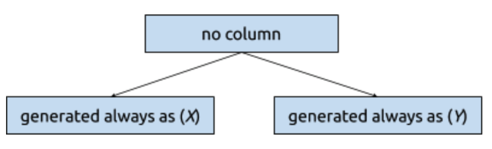

#### Stored generated columns

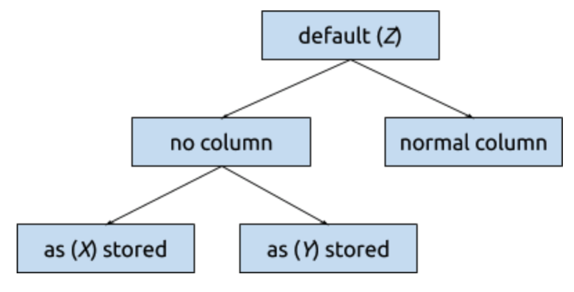

A stored generated column can be changed to a normal column, and vice-versa on MySQL. TiDB does not support changing a normal column to a stored generated column though.

```sql
-- Original schema: create table tbl (a int, b int as (a + 1) stored);
alter table tbl01 modify column b int;
-- ^ no longer generated
alter table tbl01 modify column b int as (a - 1) stored;
-- ^ again generated and overwrites everything (not supported by TiDB)
```

Changing a stored generated column to a normal column is effectively the same as adding the column, since the generated column is filtered out when reconstructing the SQL from binlog event.

Hence, the above DDL statements should be translated as

```sql
-- generated → normal, first shard
alter table tbl modify column b int default null;
-- generated → normal, last shard
alter table tbl alter column b drop default;
-- normal → generated, first shard
alter table tbl alter column b set default null;
-- normal → generated, last shard
alter table tbl modify column b int as (a - 1) stored;
```

### Partitions

(TODO: Fill in. But is anyone sane enough to manually shard partitioned tables?)

### Creating and dropping tables

```sql
create table tbl99 (…);
drop table tbl02;
recover table tbl02;
rename table tbl01 to irrelevant_table;
rename table irrelevant_table to tbl01;
```

When we create or drop a table, it would move into or out of the sharding group. This could have gazillions of effects on the group’s joined schema. For instance, all partially many added/dropped/renamed columns may suddenly be all confirmed due to losing a member.

DM would try its best to deduce the necessary DDL statements to reproduce the large diff, but some context can be lost (like add/drop vs rename).

(Note: currently DM ignores “drop table” and “drop database” DDLs involving sharding groups. We may continue to do so.)

### Idempotent DDLs

Some DDL statements do not have any noticeable effect on the schema. These DDLs, if proved to be idempotent, could be propagated directly downstream. Examples:

- Reordering columns

- Changing table’s options (default character set, auto-increment ID, comment, etc.)

- Changing column’s options (comment)

- Truncating the table (really?)

### Unsupported DDLs

DDL statements which the Schema Tracker does not understand or DM master cannot join should pause DM worker. User can sql-skip these statements and resume.

## Restrictions

DM had some [restriction](https://pingcap.com/docs/dev/reference/tools/data-migration/features/shard-merge/#restrictions) when managing sharded tables. With the design above, these restrictions still remain:

- DDLs not recognized by TiDB are not supported, including but not limited to:
  
  - Renaming columns
  
  - Incompatibly changing column types (e.g. integer <-> char)
  
  - Adding or removing primary keys

- Renaming, creating and dropping table should only be performed when the schemas among all shards are consistent.

- Schemas of the shards should not be diverged in a way that result in conflict, e.g. you should not  
  
  - add a column on two shards with same name but different types
  
  - add a column on two shards with same name but different default values
  
  - add a generated column to two shards with same name but different generated expressions
  
  - add an index on two shards with same name but different key parts
  
  - (we could try to explore further cases by fuzzing with generated DDLs and DMLs)
  
  - (the effect of violating these cases should be documented)

- Upstream and downstream should have the same sql_mode.

Risks:

- All schemas of every shards should be consistent before and after running a batch of DDL statements. (← please further clarify)

  - or, no DMLs before the schemas could become inconsistent
  
  - worst-case fix: re-synchronize from the point where all schemas were still consistent.

Some restrictions are lifted, e.g.

- You can now execute DDLs in different order or combination, as long as the final result converges.

- The upstream MySQL schemas and downstream TiDB schema does not need to exactly match; ensuring upstream ≤ downstream is enough.

## Task management

Programs can go wrong, and we may need to fix the states manually. We will need the following additional commands:

- disable-ddl-propagation

  - Disallows DM master sending DDLs to downstream.

- enable-ddl-propagation

  - Allows DM master sending DDLs to downstream. The schema diff during the period while DDL propagation was disabled are to be executed immediately.

- set-schema --worker 192.168.1.10:8262 --table '`db01`.`tbl02`'

  - Forcibly replaces a table’s schema by a custom “create table” statement. 

Commands involving DDL locks (show-ddl-locks, unlock-ddl-lock, break-ddl-lock) can be removed.

## Scratch pad (please ignore)

---

[VMware Tungsten Replicator](https://pubs.vmware.com/continuent/tungsten-replicator-5.0-oss/index.html) supports replicating MySQL binlog or Oracle CDC to any custom downstream database. The scenario closest to shard merging is [fan-in topology](https://pubs.vmware.com/continuent/tungsten-replicator-5.0-oss/deployment-fanin.html), where multiple masters replicate data to the same slave.

However, in face of online schema change, TR simply recommends [pausing replication to the slave](https://pubs.vmware.com/continuent/tungsten-replicator-5.0-oss/operations-schemachanges.html) when performing the DDLs, which isn’t a useful solution to us.

---

A prior art for this is [Citus](http://docs.citusdata.com/en/v8.3/develop/reference_ddl.html), which only officially supports automatic handling of some special DDL kinds on a distributed table, such as “add column”, “drop index”, etc. Other statements must be [executed manually](http://docs.citusdata.com/en/v8.3/develop/reference_propagation.html#manual-prop) on the shards.

---

We cannot support renaming where a column is both the source and target

```sql
alter table tbl01 rename column d to e;
alter table tbl01 rename column c to d;
```

This would require downstream to accept the DML `insert into tbl (d) values (...);` with potentially two different types. DM master can prevent such situation by reporting error on the second DDL, by examining the column’s state transition.

| old \ new | dropped → partial | partial → partial | partial → exists |
| --------- | ----------------- | ----------------- | ---------------- |
| exists → partial | first shard | ? | ? |
| partial → partial | ? | remaining shard | ? |
| partial → dropped | ? | ? | last shard |
