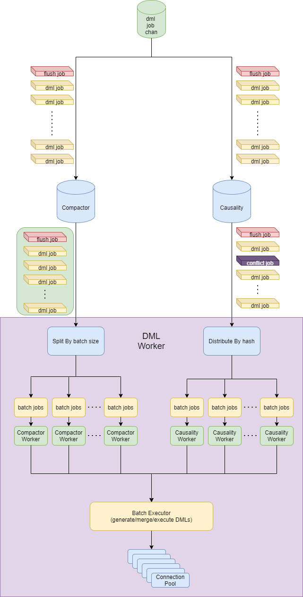
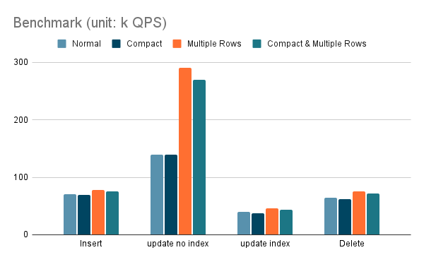

# Proposal: SQL Execution Optimization

- Author(s):    [gmhdbjd](https://github.com/gmhdbjd)
- Last updated: 2021-10-08

## Background

When the user replicates sharding task and the upstream has high-write workload, the downstream may have write bottleneck, resulting in the inability to catch up with the upstream or high synchronization latency. By analyzing the write logic, we try to optimize dml execution logic to maximize catching up with the upstream write speed when TiDB reaches the performance bottleneck.

## Design

### Compactor

Some users' write logic is: one INSERT statement followed by multiple UPDATE statements in a short time. We consider merging these DMLs into one INSERT statement, which can reduce the number of SQL synchronized to downstream.

```
# Assuming that UPDATE statement does not update the primary key. If no primary key, choose a UNIQUE NOT NULL Key.
# If UPDATE statement update the primary key or unique key, split it into one DELETE and one INSERT statement.
# We list two successive DMLs of one row and the result that can be compacted. X means this situation will not happen.
INSERT + INSERT => X
INSERT + UPDATE => INSERT
INSERT + DELETE => DELETE
UPDATE + INSERT => X
UPDATE + UPDATE => UPDATE
UPDATE + DELETE => DELETE
DELETE + INSERT => UPDATE
DELETE + UPDATE => X
DELETE + DELETE => X
```

Now we can then compact all DMLs with the same primary key to a single DML (INSERT/UPDATE/DELETE), and output them in the original order.

> **Notice**
>
> We can only compact DMLs for those tables with PK or Not NULL UK.
> If a table only has a unique key which can be NULL, we cannot compact it.
> e.g.
> ```
> // column `a` is UNIQUE KEY DEFAULT NULL
> INSERT INTO tb(a,b) VALUES(NULL,1);
> FLUSH COMPACTOR
> // cannot compact these two to INSERT because it update two rows
> INSERT INTO tb(a,b) VALUES(NULL,1);
> UPDATE tb SET a=NULL, b=2 WHERE a IS NULL AND b=1;
> ```
> But we can still detect causality for it as we do now, because NULL can be regarded as a special value and can be hashed to a special worker.
>

### Merge

Users may use single SQL statement to update a large amount of data, because DM is a row-based replication, it will turn the upstream range update into multiple row update, such as one `UPDATE WHERE id>=1 and id<=10` statement will be converted into ten `update where id=x` statemnets, which has a big impact on the write performance, so consider merging multiple single value DMLs into one multi-value DML. By generating SQL with multiple values, we expect to reduce TiDB parsing statement time, network interaction latency, TiDB CPU and TiKV gRPC usage.

```
# Assuming `a` is the primary key and UPDATE statement does not update the primary key.

  INSERT tb(a,b) VALUES(1,1); 
+ INSERT tb(a,b) VALUES(2,2);
= INSERT tb(a,b) VALUES(1,1),(2,2);

  UPDATE tb SET a=1, b=1 WHERE a=1;
+ UPDATE tb SET a=2, b=2 WHERE a=2;
= INSERT tb(a,b) VALUES(1,1),(2,2) ON DUPLICATE UPDATE a=VALUES(a), b=VALUES(b);

  DELETE tb WHERE a=1
+ DELETE tb WHERE a=2
= DELETE tb WHERE (a) IN (1),(2);
```

By combining multiple update statements into a single `INSERT ON DUPLICATE UPDATE` statement, TiDB can use batch get rather than point get, which will reduct gRPC usage.

### DML Flow

Now, all the DMLs compacted by compactor will be sent to causality, and then we can execute DMLs by hash in parallel.

So the processing flow of DML will look like the following diagram.



- Compactor compacts DMLs, output a ***batch*** of DML jobs in original order and flush job(receive from input channel)
- Causality detects conflict for DMLs, output DML jobs, conflict job(conflict detected) and flush job(receive from input channel) in ***streaming***
- DMLWorker receives DML jobs from Causality in streaming, distribute them to the Workers by hash key, each Worker executes batch jobs and wait for next batch of jobs.

> **Notice**
> 
> According to the principle of latency first, all components must give priority to output DML jobs when the downstream load is low, which means compactor should flush buffer when ouput channel is empty even if the buffer is not full and DML workers should execute jobs when previous jobs are executed even if the batch is not full. 
> 

## Configuration

Two configuration items will be added to the task configuration file, and their default values ​​will both be false.
```
syncers:
  global:
    compact: true
    multiple-rows: true
```

### Benchmark

Through a demo, it is measured that under a specific environment, merge multiple DMLs into a multi value DML has 9%, 100%, 15%, 18% row QPS improvement respectively in bulk insert, no index update, index update and delete.

| unit: k QPS	| Normal | Compact | Multiple Rows | Compact & Multiple Rows |
| :-----------: | :----: | :-----: | :-----------: | :---------------------: |
| INSERT	| 71 | 69 | 78 | 75 |
| UPDATE NO INDEX | 140 | 140 | 290 | 270 |
| UPDATE INDEX	| 40 | 37 | 46 | 43 |
| DELETE	| 64 | 62 | 77 | 72 |


