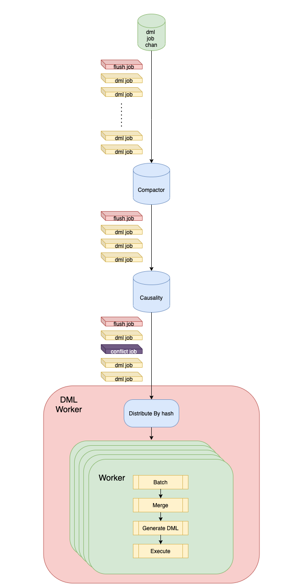

# Proposal: SQL Execution Optimization

- Author(s):    [gmhdbjd](https://github.com/gmhdbjd)
- Last updated: 2021-10-08

## Background

When the user replicates sharding task and the upstream has high-write workload, the downstream may have write bottleneck, resulting in the inability to catch up with the upstream or high synchronization latency. By analyzing the write logic, we try to optimize dml execution logic to maximize catching up with the upstream write speed when TiDB reaches the performance bottleneck.

## Design

### Compactor

Some users' write logic is: one INSERT statement followed by multiple UPDATE statements in a short time. We consider merging these DMLs into one INSERT statement, which can reduce the number of SQL synchronized to downstream.

```
# Assuming that UPDATE statement does not update the primary/unique key.
# If UPDATE statement update the primary/unique key, split it into one DELETE AND one INSERT statement.
# For multiple unique keys, treat all primary keys and unique keys as one big primary key.
# X means this situation will not happen
INSERT + INSERT => X
INSERT + UPDATE => INSERT
INSERT + DELETE => NULL(DELETE)
UPDATE + INSERT => X
UPDATE + UPDATE => UPDATE
UPDATE + DELETE => DELETE
DELETE + INSERT => UPDATE
DELETE + UPDATE => X
DELETE + DELETE => X
```

Now we can then compact all DMLs with the same primary and unique key to a single DML (INSERT/UPDATE/DELETE), which can be executed in parallel since they all have different primary and unique keys.

### Merge

Users may use single SQL statement to update a large amount of data, because DM is a row-based replication, it will turn the upstream range update into multiple row update, such as one `UPDATE WHERE id>=1 and id<=10` statement will be converted into ten `update where id=x` statemnets, which has a big impact on the write performance, so consider merging multiple single value DMLs into one multi value DML. By generating SQL with multiple values, we expect to reduce TiDB parsing statement time, network interaction latency, TiDB CPU and TiKV grpc usage.

```
# Assuming `a` is the primary key and UPDATE statement does not update the primary key.

  INSERT tb(a,b) VALUES(1,1); 
+ INSERT tb(a,b) VALUES(2,2);
= INSERT tb(a,b) VALUES(1,1),(2,2);

  UPDATE tb SET a=1, b=1 WHERE a=1;
+ UPDATE tb SET a=2, b=2 WHERE a=2;
= INSERT tb(a,b) VALUES(1,1),(2,2) ON DUPLICATE UPDATE a=VALUES(a), b=VALUES(b)

  DELETE tb WHERE a=1
+ DELETE tb WHERE a=2
= DELETE tb WHERE (a) IN (1),(2);
```

By combining multiple update statements into a single `INSERT ON DUPLICATE UPDATE` statement, TiDB can use batch get rather than point get, which will reduct grpc usage.

### DML Flow

Now, all the DMLs compact by compactor can be executed in parallel since they all have different primary and unique keys. But since some tables do not have primary/unique keys to be compacted, we still need conflict detection.

So the processing flow of DML will look like the following diagram.



- Compactor compacts DMLs, output a ***batch*** of INSERT/DELETE/UPDATE jobs and flush job(receive from input channel)
- Causality detects conflict for DMLs, output INSERT/DELETE/UPDATE jobs, conflict job(conflict detected) and flush job(receive from input channel) in ***streaming***
- DMLWorker receives a group of compact jobs from Compactor, splits jobs to CompactorWorkers by batch size, executes them concurrently and then wait for next group of compact jobs.
- DMLWorker receives DML jobs from Causality in streaming, distribute them to the CausalityWorkers by hash key, each CausalityWorker executes batch jobs and wait for next batch of causality jobs.
- Executor called by CompactorWorker and CausalityWorker, it receives batch of jobs, get connection from connection pool and then generate, merge and execute DMLs to downstream.

### Benchmark

Through a demo, it is measured that under a specific environment, merge multiple DMLs into a multi value DML has 9%, 100%, 15%, 18% row QPS improvement respectively in bulk insert, no index update, index update and delete.

| unit: k QPS	| Normal | Compact | Multiple Rows | Compact & Multiple Rows |
| :-----------: | :----: | :-----: | :-----------: | :---------------------: |
| INSERT	| 71 | 69 | 78 | 75 |
| UPDATE NO INDEX | 140 | 140 | 290 | 270 |
| UPDATE INDEX	| 40 | 37 | 46 | 43 |
| DELETE	| 64 | 62 | 77 | 72 |


