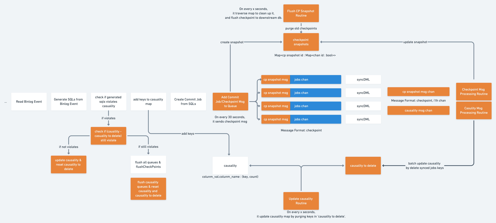

# Proposal: Async Checkpoint Flush

- Author(s):    [will](https://github.com/db-will)
- Last updated: 2021-10-12

## Abstract
This proposal introduces an asynchronous mechanism to flush checkpoint in order to improve DM incremental replication performance.

Table of contents:

- [Background](#Background)

## Background
In an incremental replication of DM, a checkpoint corresponds to the binlog position and other information of a binlog event that is successfully parsed and migrated to the downstream. Currently, a checkpoint is updated after the DDL operation is successfully migrated or 30 seconds after the last update.

For every 30 seconds, DM will synchronously flush checkpoints to the downstream database. The synchronous flushing blocks DM to pull and parse upstream binlog events, and so it impacts overall latency and throughput of DM.

Since checkpoint wasn’t designed to provide a very accurate replication progress info(thanks to [safe mode](https://docs.pingcap.com/tidb-data-migration/stable/glossary?_ga=2.227219742.2051636884.1631070434-1987700333.1624974822#safe-mode)), it’s only necessary to guarantee all upstream binlog events before saved checkpoint are replicated. Therefore, instead of synchronously flushing the checkpoint every 30 seconds, we can asynchronously flush the checkpoint without blocking DM to pull or process upstream binlog events. With async checkpoint flush, it can improve DM’s incremental replication throughput and latency.

Previously, [gmh](https://github.com/GMHDBJD) has conducted a performance testing to compare DM qps when checkpoint flush is enabled and disabled. It shows that there could be a 15% ~ 30% qps increase when checkpoint flush disabled. [glorv](https://github.com/glorv) created the initial proposal for aynsc checkpoint flush. On community side, there is a stale pr for [WIP: async flush checkpoints](https://github.com/pingcap/dm/pull/1627). But it hasn’t been updated for a very long time.

## Goals
With asynchronous checkpoint flush:
- we should be able to see improvements on DM incremental replication qps and latency.
- it should guarantee that all events before checkpoint have been flushed.
- it should be upgradable and compatible with previous versions.

## Current Implementation - synchronously checkpoints flush


As shown in the above diagram, the current bottleneck is the red box - “Add Commit Job to Queue”, where it will block further pulling and parsing upstream binlog events every 30 seconds when a flush checkpoint is needed.

### How Causality Works With Checkpoint
Here is an example about how dml generate causality relations:
```
create table t1 (id int not null primary key, username varchar(60) not null unique key, pass varchar(60) not null unique key);

insert into t1 values (3, 'a3', 'b3');
insert into t1 values (5, 'a5', 'b5');
insert into t1 values (7, 'a7', 'b7');
```

DM causality relations:
```
{
  "3.id.`only_dml`.`t1`":"3.id.`only_dml`.`t1`",
  "5.id.`only_dml`.`t1`":"5.id.`only_dml`.`t1`",
  "7.id.`only_dml`.`t1`":"7.id.`only_dml`.`t1`",
  "a3.username.`only_dml`.`t1`":"3.id.`only_dml`.`t1`",
  "a5.username.`only_dml`.`t1`":"5.id.`only_dml`.`t1`",
  "a7.username.`only_dml`.`t1`":"7.id.`only_dml`.`t1`",
  "b3.pass.`only_dml`.`t1`":"3.id.`only_dml`.`t1`",
  "b5.pass.`only_dml`.`t1`":"5.id.`only_dml`.`t1`",
  "b7.pass.`only_dml`.`t1`":"7.id.`only_dml`.`t1`",
}
```

For each DML generated from upstream binlog event, DM will create a list of causality keys from primary key and unique key related to the DML, and then those keys will be added into global causality relations map. If a DML contains unique keys, those unique keys' value will point to the primary key as described in above causality relation map example.

Causality is used to prevent dmls related to the same primary key or unique key from being executed out of order. For example:
```
create table t1(id int primary key, sid varchar)
update t1 set sid='b' where id = 1
update t1 set sid='c' where id = 1
update t1 set sid='d' where id = 1
```

With a causality mechanism, we are guaranteed that these dmls will be executed in the same order as the upstream database does.


## Proposed Implementation - asynchronously checkpoints flush

The component colored with orange are new components added for async checkpoint flush.

Instead of blocking to flush checkpoint, the idea of asynchronous flush checkpoint is to add a checkpoint snapshot message into each job channel, and forward it to the checkpoint snapshot message processing unit, then it will continuously update a central checkpoint map; At the same time, we periodically scan the central checkpoint snapshots map to flush the most recent checkpoint snapshot that already received all jobs chan’s checkpoint snapshot flush message, and clean up flushed checkpoints in the map.

The central checkpoint snapshot map is a map that uses a checkpoint snapshot id as key, a map of channel id mapped to bool as value.

The checkpoint snapshot id is a specific format of time(eg. 0102 15:04:05) representing when it’s created, and so we can easily sort them based on when it’s created.

The job channel id to bool map indicates which job channel’s checkpoint snapshot message has been received. As long as we have received all job channel’s checkpoint snapshot messages, we can flush the checkpoint snapshot.

However, the missing part is that we are leaving the causality structure filled with flushed jobs causality keys, and hence it could falsely trigger checkpoint flush even if the conflicting key’s jobs have been executed/flushed. We still need to explore the workload potentially causing a serious performance impact with the async checkpoint flush.

### Causality Optimization

The component colored with orange are new components added for async checkpoint flush.

At the time of executing a batch of sql jobs in syncDML, we can collect those causality keys from these executed sql jobs, and so we can collect causality keys to delete in a separate data structure(TBD). There is a seperate routine running in background to purge causality keys to delete and update current causality on certain time interval.

Whenever we detect causality conflicts during processing upstream binlog event, we can update the current out-of-date causality with those causality-to-delete keys, and then recheck if it still violates causality rules. If still so, we will need to pause and flush all jobs in the channel.

This optimization is designed for keeping causality up to date and hence avoid stale causality keys conflicts caused checkpoint flush.

## Testing
A separate testing doc needs to be created to fully design the testing cases, configurations and workload, failure points etc. In this section, we describe key points we need to evaluate the performance and compatibility of asynchronous checkpoints flush feature.

### Performance
For performance testing, we would like to evaluate the asynchronous flush checkpoint feature from following aspects:
- Compared to the synchronous one, what’s the performance gain?
- Find workload/config easily violates causality check, and how does that impact performance? Does asynchronous perform better than the existing synchronous method?
- Try find workload/config cause checkpoint message queue busy/full, and check if perf is impacted?
- Check the actual performance impact with different checkpoint message interval and checkpoint flush interval

### Compatibility
For compatibility testing, we would like to evaluate async checkpoint flush compatibility with DM operations, safe mode, and previous DM versions.
- Evaluate if pause & restart DM at different point, DM will still continue works well
- Evaluate if upgrading DM from lower DM version to current DM version will work
- Evaluate if async checkpoint compatible with safe mode DM

## Metrics & Logs
Since extra components are introduced with asynchronous checkpoint flush, we need to add related metrics & logs to help us observe the DM cluster. The following design will subject to change in the development phase.

To get a better view of these new metrics and their impact on performance, we can add the [new Grafana dashboard](https://github.com/pingcap/dm/blob/master/dm/dm-ansible/scripts/DM-Monitor-Professional.json).

### Checkpoint
#### Mertics
With following two metrics, we can conclude the time span of checkpoint snapshot msg:
- To understand start time of checkpoint snapshot msg, we record the checkpoint position when it’s pushed into the job chan
- To understand end time of checkpoint snapshot msg, we record the checkpoint pos when [checkpoint msg processing routine] find out a recent checkpoint is ready to flush at the time it process the received checkpoint msg from a channel
- To understand flush time of checkpoint, we record the checkpoint when it flushed in [checkpoint flush routine]
#### Logs
Log checkpoint when it’s pushed into job channel(need to evaluate its perf impact due to large amount of log generated)
Log checkpoint when it’s ready to flush after received all job chan msg(need to evaluate its perf impact due to large amount of log generated)
Log flushed and purged checkpoints
### Causality
#### Mertics
To understand how many causality keys are added, we record the number of causality keys added into central causality structure and we can use sum to see the total number of causality keys added so far

To understand how many causality keys are resetted, we record the number of causality keys resetted.

Combine above two metrics, it will give us the number of causality keys at a certain moment.

Similar methods are applied to causality to delete structure, and we need to monitor the size of causality to delete.
#### Logs
Log information whenever causality or causality-to-delete are resetted.
Log causality keys when it’s added into causality or causality-to-delete data structure.

Both two pieces of information could be used for further debugging issues related to causality.

## Milestones
### Milestone 1 - Asynchronous Flush Checkpoint
For our first milestone, we will work on asynchronous flush checkpoint implementation, and measure the impact of causality keys conflicts.

In this stage, we focus on delivering code fast and test its performance to understand its impact for performance.

There are major work needed to be done for this milestone:
Asynchronous flush checkpoint implementation
Checkpoint related metrics and logs
Performance metrics of asynchronous flush checkpoint(especially when workload easily trigger causality conflicts)
No need to do comprehensive performance here, we focus on find out potential performance bottlenecks/impacts
Control memory consumption when no causality conflicts for a long time.

### Milestone 2 - Asynchronous Flush Checkpoint With Causality Optimization
For our second milestone, if we find there are serious impacts on async flush checkpoint performance under causality conflicts, we will work on causality optimization.

In this stage, we focus on the quality of code of async flush checkpoint code. There are major work needed to done at this milestone:
Asynchronous flush checkpoint implementation with causality optimization
Causality related metrics and logs
Performance metrics of the implementation with causality optimization(especially when workload easily trigger causality conflicts)
No need to do comprehensive performance here, we focus on find out potential performance bottlenecks/impacts
Control memory consumption when no causality conflicts for a long time.

### Milestone 3 - Testing
At this final stage, we will focus on comprehensive performance, compatibility, functionality testing, integration testing of asynchronous flush checkpoint.
There are major work needed to done at this milestone:
Testing design doc of asynchronous flush checkpoint
Configurable checkpoint flush interval config, need to support dynamically update
Conduct various testing on the feature
Optional, try DM with mock customer workload

